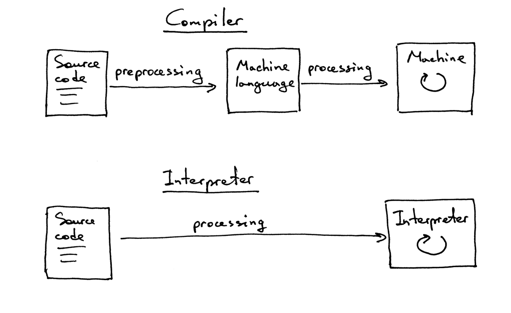

> *“想知道计算机的工作原理，你就得先知道编译器的工作原理。而如果你不能百分百确定你是否知道编译器的工作原理，那么你就不知道它的工作原理” —— Steve Yegge*

简单来说，这无关工作经验，只要你不知道编译器和解释器的工作原理，那你就没有真的理解计算机。那么问题来了，你真的知道编译器和解释器的工作原理吗？或者说，你确定自己是否知道吗？


如果你的答案是否定的，朋友，你不必焦虑，不必担心，只要你能坚持到这个系列结束，你就可以创造出一个解释器来。届时，上面的问题将会迎刃而解，而你也会在这个过程中收获颇丰，至少我希望如此😀


或许你会问，“我为什么要学编译器的工作原理”，这里白给你送上三条理由说服自己，不用谢：
1. 你想要**强化编程技术**。想要编写一个解释器或编译器，你需要许多前置技术，并将这些技术很好地结合起来。而在编码的过程中，你对这些技术的理解会更加深刻，同时也会让你变得更强。因为这些技术并非仅仅适用于当下，在未来的编程中，它们也会给你极大的助力。
2. 你想要**理解计算机的工作原理**。可能在你看来，编译器就像个魔法师一样：给它一个单词组成的代码，它就能给你一个可以让计算机运行的软件。这说起来很浪漫，但作为技术人员的你可不能满足于此，你得搞清楚它背后的运行机制，然后在编程时才能游刃有余。
3. 你想要**创造属于自己的编程语言**。这个太TMD容易拿来装逼了你不觉得吗！当然，想要创造自己的编程语言，你就得为它写一个解释器或者编译器。说起来，最近掀起一股新语言的热潮，各种编程语言如雨后春笋般涌现，Elixir，Go，Rust等等，难道你不想蹭一波热度吗🤩

回归正题，什么是解释器和编译器呢？

我们可以简单地把解释器和编译器理解为，一种把**高级语言编写的源码翻译为其他形式**的软件，或许“其他形式”这个描述有点模糊，但是没关系，随着学习的深入，你会逐渐明白有哪些形式。

这里简单提一下解释器和编译器的区别。本系列文章中，我们认为能**把源码翻译成机器语言的软件**是编译器，而**直接执行源码的软件**是解释器。这里用图表示可能更为直观：


本系列的文章专注于实现解释器，在学习的过程中，我们会逐步实现处一个简单的Pascal语言的解释器。当然，只能解释Pascal语言的一个子集。在系列结束时，你会获得一个解释器，以及配套的源码级调试器。

你可能会问，为什么选择Pascal？首先，这个语言并非是我为写文章杜撰出来的，而是的的确确正在使用中的编程语言。它麻雀虽小而五脏俱全，编程语言该有的结构它都有。其次，一些老书（但很牛）中就使用Pascal语言来写例子。当然，我承认这两个理由非常无力，但是学习一个小众语言真的酷毙了( •̀ ω •́ )✧！

下面的例子是用Pascal语言写的一个阶乘函数，在系列的最后，这段代码可以在你的解释器上完美运行，并且能进行代码级的交互式调试：
```Pascal
program factorial;

function factorial(n: integer): longint;
begin
	if n = 0 then
		factorial := 1
	else
		factorial := n * factorial(n - 1);
end;

var
	n: integer;

begin
	for n:= 0 to 16 do
		writeln(n, '! = ', factorial(n));
end.
```

文章将会使用Python语言来实现Pascal解释器，当然，哪种语言并不重要，实现解释器的思路是一样的。好了，闲话少叙，就此开始！

你的编程之旅将从实现一个简单的解释器开始，这个解释器可以解析数学表达式，可能在你们那儿这玩意儿叫计算器更合适。今天的目标也非常简单：只要能识别并计算一个加法表达式即可，比如`3 + 5`。在看源码之前，你可以试着用自己的方式实现，然后进行对比，或许收获会更多。

下面是计算器的源码，不好意思，应该说解释器的源码(\*^\_^\*)：
```Python
# 词元类型
# EOF (end-of-file)表示词法分析已经结束
INTEGER, PLUS, EOF = 'INTEGER', 'PLUS', 'EOF'

class Token(object):
    def __init__(self, type, value):
        # 词元类型: INTEGER, PLUS, or EOF
        self.type = type
        # 词元取值: 0, 1, 2. 3, 4, 5, 6, 7, 8, 9, '+', or None
        self.value = value

    def __str__(self):
        """对象的字符串表达.
        例:
            Token(INTEGER, 3)
            Token(PLUS, '+')
        """
        return 'Token({type}, {value})'.format(
            type=self.type,
            value=repr(self.value)
        )

    def __repr__(self):
        return self.__str__()

class Interpreter(object):
    def __init__(self, text):
        # 命令行的字符串输入, 例如"3+5"
        self.text = text
        # self.pos是self.text的下标
        self.pos = 0
        # 当前正在处理的词元
        self.current_token = None

    def error(self):
        raise Exception('Error parsing input')

    def get_next_token(self):
        """词法解析器（别名，tokenizer，分词器）
        该函数负责将字符串分解成一个个词元
        每次调用返回一个词元
        """
        text = self.text

        # self.pos下标是否指向self.text的最后一个字符？
        # 如果是，那么表示后续没有内容需要转化为词元了，返回EOF
        if self.pos > len(text) - 1:
            return Token(EOF, None)

        # 获取位于self.pos处的字符，然后判断基于这个字符要创建什么词元
        current_char = text[self.pos]

        # 如果字符是数字，那么将其转换为整型，即创建一个 INTEGER 词元，
        # 将self.pos指向下一个字符，然后返回 INTEGER 词元
        if current_char.isdigit():
            token = Token(INTEGER, int(current_char))
            self.pos += 1
            return token

        if current_char == '+':
            token = Token(PLUS, current_char)
            self.pos += 1
            return token

        self.error()

    def eat(self, token_type):
        # 将传入的词元类型于当前的词元类型进行比较，如果匹配成功，
        # 那么就“吃掉”当前的词元，然后把下一个词元赋值给self.current_token
        # 否则报错
        if self.current_token.type == token_type:
            self.current_token = self.get_next_token()
        else:
            self.error()

    def expr(self):
        """expr -> INTEGER PLUS INTEGER"""
        # 将从输入获取的第一个词元赋值给当前的词元
        self.current_token = self.get_next_token()

        # 我们期望当前的词元的类型应该是整数类型
        left = self.current_token
        self.eat(INTEGER)

        # 我们期望当前的词元的类型应该是加法类型
        op = self.current_token
        self.eat(PLUS)

        # 我们期望当前的词元的类型应该是整数类型
        right = self.current_token
        self.eat(INTEGER)
        # 在上述流程结束后，self.current_token应该设置为 EOF 词元

        # 到此为止，我们已经找到了INTEGER PLUS INTEGER的词元序列，
        # 函数也可以直接返回两个数字的和，也就是说，
        # 我们非常高效地解释了用户输入
        result = left.value + right.value
        return result

def main():
    while True:
        try:
            text = input('calc> ')
        except EOFError:
            break
        if not text:
            continue
        interpreter = Interpreter(text)
        result = interpreter.expr()
        print(result)

if __name__ == '__main__':
    main()
```

把代码保存到`cal1.py`文件中，或者干脆直接从[GitHub](https://github.com/rspivak/lsbasi/blob/master/part1/calc1.py)下载下来。在读代码之前，先跑一下看看它的输入输出分别是什么，下面内容是我在自己的电脑上运行出的结果，一起玩一下吧！
```shell
$ python calc1.py
calc> 3+4
7
calc> 3+5
8
calc> 3+9
12
calc>
```

为了防止你的超简单计算器撂挑子不干，输入的时候要遵守以下几条规则：
- 只能输入单个数字
- 只能输入加法表达式
- 不能输入空格

你可能会觉得，这么多的限制，这个计算器根本没法正常使用。其实这些限制只是为了能让我们的计算器在一开始的时候，实现起来能简单些，毕竟输入越简单，处理就越简单。当然，马上我们就能让他的功能丰富起来。好了，话不多说，来一起看看这个解释器是怎么计算数学表达式的。

当你在命令行输入`3+5`时，解释器会通过输入函数获得一个字符串`"3+5"`。为了能理解这个字符串的含义，它需要将其分解为一连串的**词元（token）**[^1]，词元在代码中的定义为一个带有类型和值的类。例如，`"3"`就是一个类型为INTEGER，值为`3`的词元。

在编译原理中，这个把字符串分解为一个个词元的过程叫做**词法分析（Lexical Analysis）**，而在解释器中负责这个功能的模块叫做**词法分析器（Lexical Analyzer）**，如果你提前了解过编译原理，那么你可能听过它的其他名字，比如**Scanner**或者**tokenizer**之类的。具体到今天的解释器，词法分析器要做的事情就是把每一个字符转化为词元，以形成词元流[^2]。

为什么是把“每一个字符转化为词元”，有没有可能多个字符转化为一个词元？就今天的解释起来说，这句话是准确的。这是因为在上面三个规则的限制下，我们输入的每一个字符都是符合词元概念的。而随着后续解释器功能丰富起来，词元也就不再限制字符数量了。

代码中`Interpreter`类的成员函数`get_next_token`就是前文提到的词法分析器，每次调用，它就会返回一个根据当前字符创建出来的词元。那么，这个函数具体是怎么把字符转化为词元的呢？

以输入的字符串`3+5`为例，字符串会被存储在变量`text`中，而变量`pos`则用于表示字符串的下标。

在最开始，`pos`初始化为`0`，其指向字符串的第一个字符`'3'`。当`get_next_token`被调用时：
1. 它先判断字符是否为数字，`'3'`是数字，判断成功；
2. `pos`加一，指向字符串的下一个字符`'+'`；
3. 返回一个INTEGER类型的词元实例，该词元值为整型`3`。


现在，`pos`指向字符`'+'`，当`get_next_token`被调用时：
1. 判断`pos`所指向的字符是否为数字，`'+'`不是数字，判断失败；
2. 判断字符是否为加号，判断成功；
3. `pos`加一，指向字符串的下一个字符`'5'`；
4. 返回一个PLUS类型的词元实例，该词元值为字符`'+'`。

现在，`pos`指向字符`'5'`，当`get_next_token`再一次被调用时：
1. 判断`pos`所指向的字符是否为数字，判断成功
2. `pos`加一，下标越界，指向无效值
3. 返回一个 INTEGER 类型的词元实例，该词元值为整型`5`。


最后，`pos`所指向的下标为字符串`"3+5"`的末尾，也就是说，下一次再调用函数`get_next_token`：
1. 判断`pos`所指向的字符是否为数字，判断失败；
2. 判断`pos`所指向的字符是否为加号，判断失败；
3. 返回一个EOF类型的词元，该词元值为空。


现在，你可以在命令行中直接调用`Intepreter`类来试试计算器的词法解析器的工作方式：
```bash
>>> from calc1 import Interpreter
>>>
>>> interpreter = Interpreter('3+5')
>>> interpreter.get_next_token()
token(INTEGER, 3)
>>>
>>> interpreter.get_next_token()
token(PLUS, '+')
>>>
>>> interpreter.get_next_token()
token(INTEGER, 5)
>>>
>>> interpreter.get_next_token()
token(EOF, None)
>>>
```

通过词法解释器，我们已经把输入的字符串转化为了词元流。为了能理解这些词元流想要表达什么意思，我们需要从中找出一个特定的序列：INTEGER -> PLUS -> INTEGER。这个序列用人话说就是，先找到一个整型的词元，它后面应该跟着一个加法类型的词元，最后跟着一个整型的词元。

值得一提的是，由于目前计算器仅处理加法表达式，也就是说预期的词元序列仅有一种。而上面Pascal代码的例子你也看到了，到时候预期的词元序列也将更多。

代码中负责找出这个序列并进行解释的函数时`expr`，这个函数的实际工作是验证输入的词元序列是否符合预期，也就是INTEGER -> PLUS -> INTEGER。找到这个序列以后，函数会把加号左右两边的词元值取出并相加，返回计算结果。到此为止，`expr`函数完成了它的工作，而解释器也成功地把你传入的数学表达式计算完成了。

你可能注意到了，`expr`函数使用了一个辅助函数`eat`来验证当前的词元类型是否符合序列的预期。预期的词元类型会以参数的方式传入`eat`函数，函数会将其与`current_token`的类型进行比较：
1. 如果判断一致，就调用`get_next_token`函数将`current_token`更新为输入的词元流的下一个词元；
2. 如果判断不一致，则表示解释器无法解析输入的词元流，需要终止运行，`eat`会抛出异常。

因为每当判断符合预期后，`eat`函数都会接受一个词元，并把新的词元“放到嘴边”，这个过程就像是在一口一口地把词元吃掉，因此函数名为`eat`确实挺贴合其含义的。

在最后，让我们回顾一下整个解释器在计算数学表达式时做了哪些：
- 解释器接收了一个输入的字符串，假设是`"3+5"`
- 解释器调用`expr`函数在词元流中找出了特定的序列，这个词元流是在`expr`函数运行的时候实时转换的。它想要找的序列形式为INTEGER -> PLUS -> INTEGER，在确认了这个序列后，解释器会把两个INTEGER类型的词元值加在一起，因为它很清楚自己要做的就是把两个整数(`3`和`5`)相加。

你已经学会了怎么去构建第一个解释器！给自己个赞赞！👍

现在是练习时间！


纸上得来终觉浅，绝知此事要躬行，趁热乎做两道习题，把刚刚看进去的知识捋清楚：
1. 修改代码，使其支持多数字整型的输入，例如`"12+3"`
2. 增加一个函数用于跳过空格字符，使你的计算器可以处理带有空格的输入，例如`" 12+3"`
3. 修改代码，把加法替换成减法，例如`"7-5"`

**通过这几个问题看看自己有没有理解**
1. 什么是解释器
2. 什么是编译器
3. 解释器和编译器的区别是什么
4. 什么是词元
5. 把输入分解成词元的过程叫什么
6. 解释器中执行词法解释的部分叫什么
7. 在解释器和编译器中，执行词法解释的部分的其他通用名称是什么

在结束之前，我想说，我非常希望你能从今天开始，好好学习解释器和编译器，把它放到重中之重的地方，只有这样你才能学好它。

如果你没有精读此文，那么就再读一遍！
如果你没有做练习，那么现在就动手！
如果觉得太简单只做了一部分，那么现在把剩下的做完！

毕竟没有一个程序员可以只靠浏览博客成为大牛。

最后，给自己立个Flag吧，对自己承诺从今天开始学习解释器和编译器！

*我，____，特此承诺，自今日始学习解释器与编译器，原理一日不明了，便一日学习不止*
*签名：*
*日期：*


署名后写下日期，然后把它贴在一个你每天都能看到的地方，以保证你可以坚持自己对自己的承诺，不要忘了古人的告诫：
>  “言必信，行必果” —— 《论语·子路》

好了，今天到此为止。下一篇文章，你会修改计算器，让它能处理更为复杂的数学表达式，敬请期待。

如果你等不及第二篇文章，并且想要立马深入学习编译原理，这里有一个书单应该可以帮助到你：
1. [编程语言实现模式](https://book.douban.com/subject/10482195/)
2. [Writing Compilers and Interpreters](https://book.douban.com/subject/4204346/)
3. 编译原理三大经典书籍，龙书，虎书，鲸书

### 注释
[^1]: 词元含义是指文本的最小单位，在本文中引申为表达式的最小单位，它可以是一个字符，一个数字，一个单词，一个标点符号
[^2]: 流的概念是编程中一个比较抽象的概念，就是把一堆按顺序处理的东西比作水流，词元流就是连续被处理的词元组成的“水流”